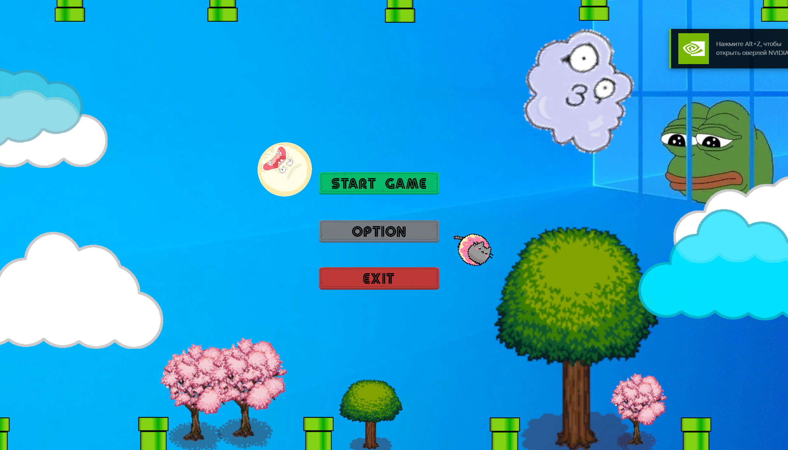
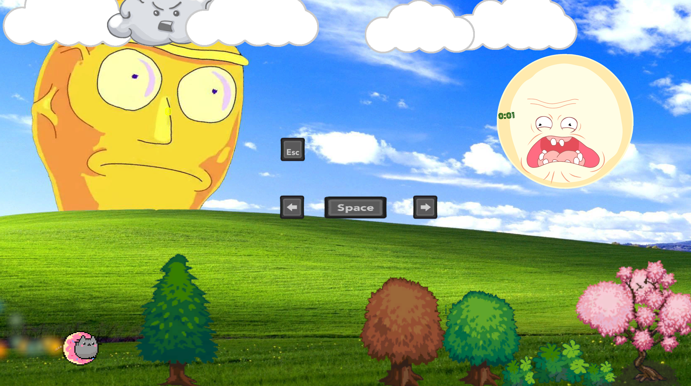

# 🌈 2D Unity Arcade — Nyan Flap (Prototype)

A colorful and chaotic 2D prototype game built with Unity.  
Inspired by Flappy Bird and Nyan Cat, this game combines fast-paced controls, dynamic UI hints, and absurd energy.

## 🎮 Gameplay Highlights
- Arrow + spacebar controls
- Interactive control hints: they disappear when keys are pressed!
- Nyan Cat soundtrack and retro-styled chaos
- Designed to feel a bit like a cursed arcade game from an alternate timeline 😅

## 🛠 Technologies
- Unity Engine (2D)
- C#
- Animator, Input System
- Sound integration

## 📦 Status
🟢 Active prototype — not finished but totally fun to show off

## 💡 Notes
This project started as an experiment in user feedback, UI interactivity, and sound layering.
## 📸 Screenshots
# 🎮 Nyan Flap — 2D Chaos Cat Game

A chaotic, fast-paced arcade game inspired by Flappy Bird and Nyan Cat.  
Fly through absurd levels, guided by meme music, cursed faces, and UI that teaches you controls by disappearing.  

### 🎮 Main Menu  

### 🕹️ Control Tutorial  

